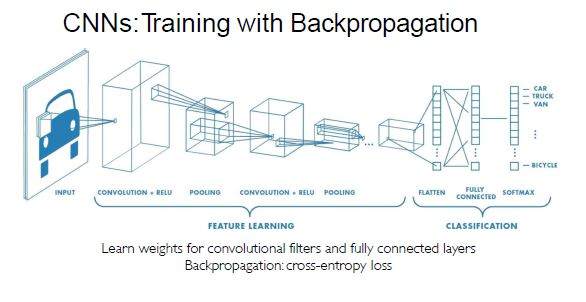

# STATS 315: Lecture 17 (CNN II) 

## What do computers see?
* Computers take in images as numbers, representing pixel values
    * Could be RGB
* Regression: Output varialbe takes continuous value
* Classification: Output variable takes class label, can produce probability of belonging to a particular class

### High Level Feature Detection
* Identify key features in each image category
* Might be good for key features
    * Person: Nose, Eyes, Mouth
    * Car: Wheels, License Plate, Headlights
* How do we represent these features using numbers?

### Manual Feature Extraction
* Domain Knowledge
* Define Features
* Detect Features to classify

### Learning Feature Representations
* Hierarchy of features directly from the data instead of hand engineering?
* Low level --> Mid level --> High level
    * Shapes --> Some features --> Recognition

## Fully Connected NN
* Will fail in this task
* Input: 2D Image, Vector of pixel values
* Fully Connected:
    * Connect neuron in hidden layer to all neurons in input layer
    * No spatial information
    * And many, many parameters
* How can we use spatial structure in the input to inform the architecture of the network?

### Using Spatial Structure
* Input: 2D image, array of pixel values
* Idea: Connect patches of input to neurons in hidden layer
    * Neuron connected to region of input, only "sees" these values
* Patch --> Some Kernel that we can 
* Connect the patch in input layer to a single neuron in the subsequent layer
    * Use a sliding window to define connections
* How can we weight the patch to detect particular features?

### Applying Filters to Extract Features
* Apply a set of weights, a filter, to extract local features
* Use multiple filters to extract different features
* Spatilaly share parameters of each filter
    * Features that matter in one part of the input SHOULD matter elsewhere

### Feature Extraction with Convolution
* Filter of 4 by 4 --> 16 weights
* Apply this same filter to 4 by 4 patches of images
* Shift by 2 pixels for next patch
* "Convolution"
* What about padding? What if our patch goes beyond dimension of the image?

### X or X? (Case Study)
* Refer to lecture slides, but image two different X's written (one straight, one more tilted)
* Want to classift even if shifted, shrunk, rotated, or deformed
* Note:
    * Convolution is element wise multiplication, then we ADD the outputs
    * Can we apply an activation function on that?
    * Higher values in the filter --> indicate it is the feature we want to identify

## Convolutional Neural Networks

### CNNs for Classification
1. Convolution: Apply filters with learned weights to generate feature maps
    * Creates multiple of these
2. Non-Linearity: Often ReLU (for each feature map)
3. Pooling: Downsampling operation on each feature map
* Train model with image data, learn weights of filters in convolutional layers

### Convolutional Layers: Local Connectivity
* For a neuron in hidden layer:
    * Take patch inputs
    * Weighted sum
    * Apply bias
* $\sum_{i=1}^n\sum_{j=1}^m w_{ij}x_{i+p,j+q} + b$

### Spatial Arrangement of Output Volume
* Layer Dims: $h \times w \times d$
    * $h$ and $w$ are spatial dimensions, $d$ = number of filters
* Stide: Filter step size
* Receptive Field: Locations in input image that a node is oath connected to
* Padding: ?

### Non-linearity
* Apply after every convolution operation (after convolution layers)
* ReLU: Pixel by pixel operation, replaces negatives with 0's
    * Non-Linear!

### Pooling:
* How can we downsample + preserve spatial invariance?
* MaxPool: Take largest number in the filter, can add stride and padding

### Representation Learning in Deep CNNs
* Low Level --> Conv 1
* Mid Level --> Conv 2
* High Level --> Conv 3

### CNNs for Classification: Feature Learning
1. Learn features of input image with convolution
2. Non-linearity through actication function (real world data is non-linear!)
3. Reduce dimensionality and preserve spatial invariance via pooling

### CNNs for Classification: Class Probabilities
* CONV and POOL layers will output high level features of input
* Fully connected layer uses them to classify
* Express output as a *probability* of image belonging to a particular class

## Architecture for Many Applications
* Object Detection with R-CNNs
* Segmentation with Fully Convolutional Networks
* Image captioning with RNNs

### Beyond Classification
* Seatnic Segmentation --> Identify where the object in the image is
* Object Detection --> See what object(s) are in the image
* Image Captioning --> Describe that is happening in the image

### Semantic Segmentation: FCNs
* FCN = Fully Convolutional Network
* Designed with ALL convolutional layer
    * Contains downsampling and upsampling

### Object Dectection with R-CNNs
* Region-Based CNNs
* Find regions that we think have objects, use CNN to classify
1. Image Input
2. Extract Region Proposals
3. Compute CNN Features
4. Classify regions 

### Image Captioning
* Classification vs. Captioning